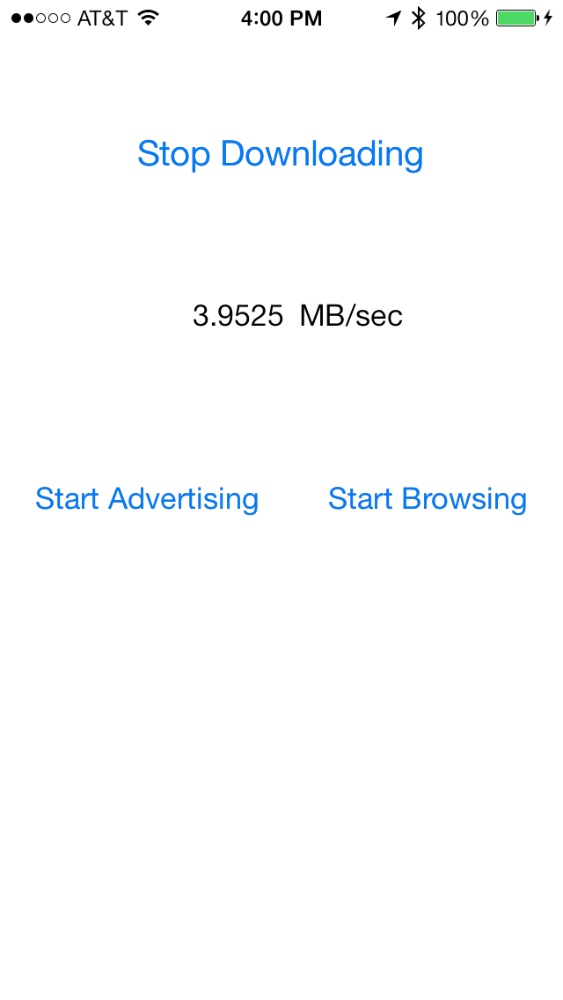

MZSMultipeerTest
================

Multipeer network throughput demo (for a blog post). Create a simple UI for turning on/off Multipeer advertising and browsing and running a file download. It's very simple but here is a screenshot of it in action for the more visually minded:

